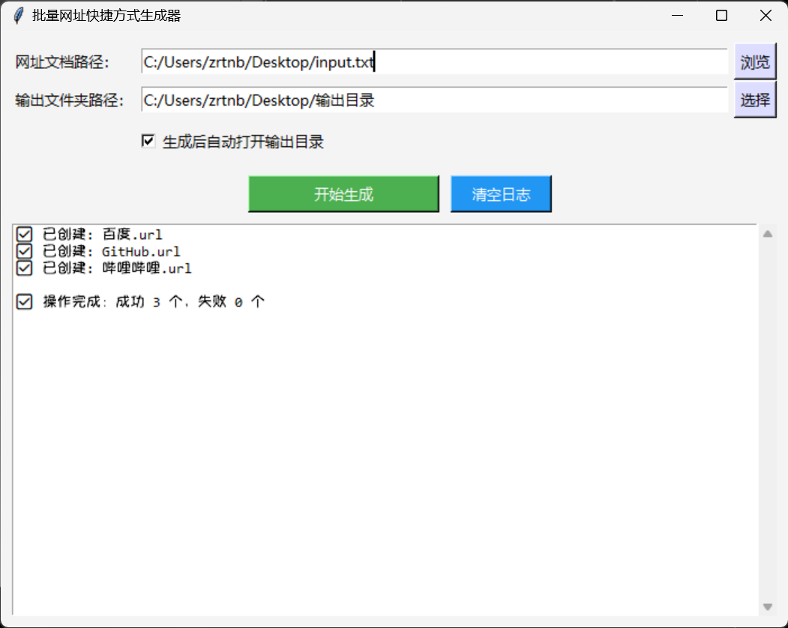

# 批量创建网站快捷方式程序

此项目为[批量创建网站快捷方式脚本](https://github.com/zrtnb6/WebShortcut-BatchScript)的延伸，增加了图形化界面，支持拖拽等

一个简单实用的 Windows 图形界面工具，支持**批量生成网址快捷方式**（.url 文件），方便收藏管理网页 

适合办公人员、学生、收藏爱好者等快速制作网页链接入口

---

## ✨ 功能亮点

- ✅ 支持批量读取 `txt` 文件并生成网站快捷方式（`url` 文件）
- ✅ 拖拽网址列表文件到输入框自动识别路径
- ✅ 支持自定义输出目录，默认输出到桌面
- ✅ 可选是否生成后自动打开输出文件夹
- ✅ 自动清理非法文件名字符，确保快捷方式创建成功
- ✅ **自动识别网站图标（favicon）并作为快捷方式图标使用**
- ✅ 图形界面清爽简洁，适合普通用户快速使用
- ✅ 打包为独立的 `exe` 文件，**无需安装 Python**

---

## 📁 使用方式

1. 创建一个 `txt` 文档（任意命名），如 `input.txt` ，内容格式如下：

    ```
    百度 https://www.baidu.com
    GitHub https://github.com
    哔哩哔哩 https://bilibili.com
    ```

2. 打开程序 `WebShortcut-GUI.exe`
3. 选择网址文件路径和输出路径
4. 点击“开始生成”，即可在输出目录下看到 `.url` 快捷方式文件

---

## 📦 打包说明（开发者向）

本项目已附带打包脚本：`build.bat`

### 🔧 功能说明：

该脚本将自动完成以下操作：

1. 安装打包工具 `pyinstaller`（如未安装）
2. 安装拖拽支持模块 [`tkinterdnd2`](https://pypi.org/project/tkinterdnd2/)
3. 自动生成带版本号的打包文件名（格式如：`main_v20250713_1432.exe`）
4. 自动清理旧的打包目录和临时文件（`build/`, `dist/`, `__pycache__`, `.spec` 文件）
5. 将程序打包为单一 `.exe` 文件，输出至 `dist/` 文件夹下

### 🛠 使用方法：

双击运行 `build.bat`

## 🖼 界面示意图

程序主界面如下所示：


